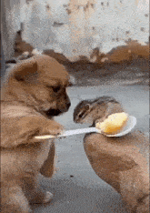

## Привет, Гитхабовец 👋

Этот проект создан теми, кто нуждается в pet-проектах, для тех, кто нуждается в pet-проектах.🤍

**PrettyPet** - это веб-платформа, на которой встречаются люди для того, чтобы создавать pet-проекты, превнося в it-сообщество чуточку больше и делая себя ближе к достижению поставленных целей. 

Сам проект написан на 5 микросервисах, каждый из которых имеет свой язык + направление:
- Next.js(фронт для главной ленты)
- React(фронт авторизованного пользователя)
- Python(бек авторизованного пользователя)
- GO(бек чатов)
- main(отвечает за настройку микросервисов)

  

<!--

**Here are some ideas to get you started:**

🙋‍♀️ A short introduction - what is your organization all about?
🌈 Contribution guidelines - how can the community get involved?
👩‍💻 Useful resources - where can the community find your docs? Is there anything else the community should know?
🍿 Fun facts - what does your team eat for breakfast?
🧙 Remember, you can do mighty things with the power of [Markdown](https://docs.github.com/github/writing-on-github/getting-started-with-writing-and-formatting-on-github/basic-writing-and-formatting-syntax)
-->
